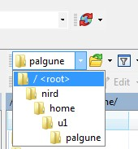

# Using WinSCP to access NIRD

We will here present how to use the program WinSCP to access NIRD. The first step will be to download the program and install it. Thereafter we will look at how to connect to NIRD. Finally we will show you how to download and upload files to NIRD.

WinSCP is a Windows program. If you are on Linux or Mac you need to use a different program, like for instance sftp.

## Installation on Windows

1.  Download the program from  <https://winscp.net/eng/download.php>.
2.  When the file is downloaded, double click on it and follow the instructions for installing the program.

## Connecting to NIRD with WinSCP

0. Make sure you have a NIRD user. If you do not, you can apply for one at <https://www.metacenter.no/user/application/form/norstore/>. Once it has been accepted, might take a day, you can continue along the steps below.
1. Start WinSCP. You should see something like this:

    

2. Fill in these values
    - Host name: login.nird.sigma2.no
    - User name: *Your username*
    - Password: *Your password*
3. Save the configuration by pressing the *Save* button.
4. Log in to NIRD by pressing the *Login* button
5. If this is your first login, you should see your home folder at NIRD in the right column of the WinSCP window.
   Since data at NIRD is located in projects we need to navigate there.
6. Use the dropdown menu:
    
    

   And navigate to the */ <root>* folder.
7. From the */* folder move into the *projects* folder and select your project.
8. Navigate to the desired place in the project folder.

## Downloading files and folders

1. In the left hand column, navigate to where you want your data stored.
2. Now you can download it by either
    - Right clicking the desired folder or file in the right column and selecting *Download*
    - or dragging the folder or file from the right column to the left column (the mouse turns into a pointer with a +)
3. Follow the dialogue boxes and wait for the download to finish.

## Uploading files and folders

1. In the right hand column, navigate to where you want your data stored.
2. In the left hand column, navigate to where the file and/or folders you want to upload are located.
3. Now you can upload them by either
    - Right clicking the desired folder or file in the left column and selecting *Upload*
    - or dragging the folder or file from the left column to the right column (the mouse turns into a pointer with a +)
3. Follow the dialogue boxes and wait for the upload to finish.

